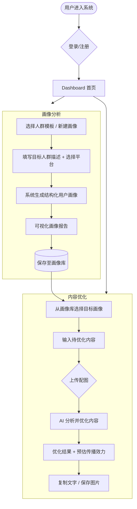

# Spread Content Optimization System

面向传播的内容生成系统 — 基于用户画像分析驱动，先分析目标人群画像，再针对性地优化传播内容。

## 系统流程



## 技术栈

| 层级 | 技术 |
|------|------|
| 框架 | Next.js 16 (App Router) |
| 语言 | TypeScript |
| 样式 | TailwindCSS v4 |
| 数据 | 前端 Mock（本地内存） |
| 部署 | GitHub Pages（静态导出） |

## 功能特性

- **模板画像** — 8 个预置人群模板，开箱即用
- **自定义画像** — 描述目标人群 + 选择平台，自动生成分析报告
- **大屏可视化** — 画像详情以仪表盘风格展示（环形图、进度条、词云）
- **内容优化** — 选中画像，输入内容，AI 自动优化适配目标人群
- **图片支持** — 上传 / 拖拽 / 粘贴配图，支持 AI 生成封面图
- **历史记录** — 所有优化记录可回溯，点击加载历史内容
- **预估传播效力** — 每次优化附带预估曝光量、互动率、转化率等指标
- **静态部署** — 全静态导出，无需后端服务

## 快速开始

```bash
# 安装依赖
npm install

# 启动开发服务器
npm run dev

# 打开 http://localhost:3000
```

## 构建部署

```bash
# 构建静态导出
npm run build

# 输出目录为 out/
# 自动生成 404.html 用于 GitHub Pages SPA 路由

# 预览构建结果
npx serve out
```

项目通过 GitHub Actions 自动部署到 GitHub Pages。推送 `main` 分支即可触发构建。

## 项目结构

```
src/
├── app/
│   ├── page.tsx            # 首页（产品介绍）
│   ├── layout.tsx          # 根布局
│   ├── login/              # 登录页
│   ├── register/           # 注册页
│   ├── personas/
│   │   ├── page.tsx        # 画像列表（卡片网格）
│   │   ├── new/page.tsx    # 新建画像（表单）
│   │   └── detail/page.tsx # 画像详情（可视化大屏）
│   └── optimize/
│       ├── page.tsx        # 内容优化（左右并排）
│       └── detail/page.tsx # 优化详情
├── components/
│   └── Navbar.tsx          # 导航栏
├── context/
│   └── AuthContext.tsx      # 登录态管理
└── lib/
    ├── api.ts              # API 接口层（Mock）
    └── mockData.ts         # Mock 数据逻辑
```

## 本地数据

所有数据存储在前端内存中，刷新页面后重置。默认预置 8 个模板画像：
- 一线城市职场女性 · 小红书
- Z世代大学生 · 抖音
- 新中产家庭决策者 · 知乎
- 数字游民/自由职业者 · B站
- 银发族养生人群 · 微信公众号
- 二次元圈层用户 · B站
- 母婴育儿妈妈群 · 小红书
- 科技极客/数码控 · 知乎
